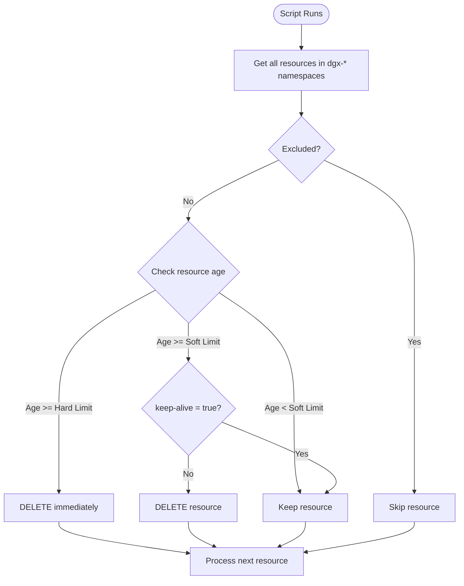

# Auto-Cleanup Administrator Guide

A Kubernetes resource cleanup tool for multi-user DGX clusters. Automatically deletes stale Deployments, Pods, and Services based on configurable age limits.

---

## Table of Contents

1. [Purpose](#purpose)
2. [Key Concepts](#key-concepts)
3. [How It Works](#how-it-works)
4. [Default Time Limits](#default-time-limits)
5. [Running the Script](#running-the-script)
6. [Cron Job Setup](#cron-job-setup)
7. [Configuration](#configuration)
8. [Exclusions](#exclusions)
9. [Logs](#logs)
10. [Protecting Resources with Keep-Alive](#protecting-resources-with-keep-alive)

---

## Purpose

The Auto-Cleanup script automatically removes stale Kubernetes resources (Deployments, Pods, and Services) from DGX cluster namespaces. This prevents resource hoarding and ensures fair access for all users.

**What gets cleaned up:**
- Deployments older than the configured limit
- Standalone Pods (not managed by Deployments/Jobs) older than the configured limit
- Services older than the configured limit

**What is NOT touched:**
- Resources in excluded namespaces
- Resources with names in exclusion lists
- Pods managed by controllers (Deployments, ReplicaSets, Jobs, etc.)
- Resources protected by the `keep-alive=true` label (within soft limit)

---

## Key Concepts

### User Categories

Users are categorized based on their namespace prefix. Each category has different time limits:

| Namespace Prefix | User Type | Description |
|------------------|-----------|-------------|
| `dgx-s-*` | Student | Student namespaces |
| `dgx-f-*` | Faculty | Faculty namespaces |
| `dgx-i-*` | Industry | Industry partner namespaces |

### Hard Limit vs Soft Limit

| Limit Type | Behavior | Keep-Alive Label |
|------------|----------|------------------|
| **Soft Limit** | Deletes resources that have exceeded the soft limit age | **Respected** - resources with `keep-alive=true` are preserved |
| **Hard Limit** | Deletes resources that have exceeded the hard limit age | **Ignored** - deletion is forced regardless of label |

### Keep-Alive Label

Users can protect their resources from soft-limit deletion by adding the label `keep-alive=true`. However, once the hard limit is reached, the resource will be deleted regardless of this label.

---

## How It Works



**Processing Order:**
1. Deployments are processed first
2. Standalone Pods are processed and queued for batch deletion
3. Services are processed last

---

## Default Time Limits

| User Type | Soft Limit | Hard Limit |
|-----------|------------|------------|
| **Student** (`dgx-s-*`) | 24 hours | 36 hours |
| **Faculty** (`dgx-f-*`) | 36 hours | 84 hours (3.5 days) |
| **Industry** (`dgx-i-*`) | 84 hours (3.5 days) | 168 hours (7 days) |

These limits can be customized in the configuration file.

---

## Running the Script

### Manual Execution

```bash
# Run the cleanup (requires root)
sudo auto-cleanup

# Run in quiet mode (errors only)
sudo auto-cleanup --quiet

# Display help
auto-cleanup --help

# Display version
auto-cleanup --version
```

### Command Location

After installation, the command is available at:
- `/usr/local/bin/auto-cleanup` (symlink)
- `/opt/auto-cleanup/bin/auto-cleanup` (actual script)

---

## Cron Job Setup

To run the cleanup automatically every hour:

```bash
# Create a cron job file
echo '0 * * * * root /usr/local/bin/auto-cleanup' | sudo tee /etc/cron.d/auto-cleanup

# Set proper permissions
sudo chmod 644 /etc/cron.d/auto-cleanup
```

This runs the cleanup at the start of every hour (e.g., 1:00, 2:00, 3:00...).

**Alternative schedules:**

```bash
# Every 30 minutes
*/30 * * * * root /usr/local/bin/auto-cleanup

# Every 6 hours
0 */6 * * * root /usr/local/bin/auto-cleanup

# Once daily at midnight
0 0 * * * root /usr/local/bin/auto-cleanup
```

---

## Configuration

### Configuration File Location

```
/etc/auto-cleanup/auto-cleanup.conf
```

### Key Settings

| Setting | Default | Description |
|---------|---------|-------------|
| `Deployment` | `true` | Enable/disable Deployment cleanup |
| `Pod` | `true` | Enable/disable Pod cleanup |
| `Service` | `true` | Enable/disable Service cleanup |
| `Deployment_HardLimit` | `true` | Enable hard limit for Deployments |
| `Deployment_SoftLimit` | `true` | Enable soft limit for Deployments |
| `Pod_HardLimit` | `true` | Enable hard limit for Pods |
| `Pod_SoftLimit` | `true` | Enable soft limit for Pods |
| `Service_HardLimit` | `true` | Enable hard limit for Services |
| `Service_SoftLimit` | `true` | Enable soft limit for Services |

### Time Limit Settings

| Setting | Default | Description |
|---------|---------|-------------|
| `STUDENT_SOFT` | `24H` | Student soft limit |
| `STUDENT_HARD` | `36H` | Student hard limit |
| `FACULTY_SOFT` | `36H` | Faculty soft limit |
| `FACULTY_HARD` | `84H` | Faculty hard limit |
| `INDUSTRY_SOFT` | `84H` | Industry soft limit |
| `INDUSTRY_HARD` | `168H` | Industry hard limit |

**Time format:** Use `M` for minutes, `H` for hours, `D` for days. Example: `30M`, `2H`, `7D`

### Editing Configuration

```bash
sudo nano /etc/auto-cleanup/auto-cleanup.conf
```

---

## Exclusions

Exclusion files allow you to protect specific namespaces or resources from cleanup.

### Exclusion File Locations

| File | Purpose |
|------|---------|
| `/etc/auto-cleanup/exclude_namespaces` | Skip entire namespaces |
| `/etc/auto-cleanup/exclude_deployments` | Skip specific deployments by name |
| `/etc/auto-cleanup/exclude_pods` | Skip specific pods by name |
| `/etc/auto-cleanup/exclude_services` | Skip specific services by name |

### File Format

- One name per line
- Lines starting with `#` are comments
- Empty lines are ignored

**Example `/etc/auto-cleanup/exclude_namespaces`:**

```
# Critical namespaces - never delete resources here
dgx-s-admin
dgx-f-shared-resources
```

### Adding Exclusions

```bash
# Exclude a namespace
echo "dgx-s-critical-user" | sudo tee -a /etc/auto-cleanup/exclude_namespaces

# Exclude a specific deployment
echo "important-deployment" | sudo tee -a /etc/auto-cleanup/exclude_deployments
```

---

## Logs

### Log Location

```
/var/log/giindia/auto-cleanup/
```

### Log File Format

Logs are rotated daily with the format:

```
auto-cleanup-YYYY-MM-DD.log
```

Example: `auto-cleanup-2025-12-14.log`

### Viewing Logs

```bash
# List log files
ls -la /var/log/giindia/auto-cleanup/

# View today's log
sudo cat /var/log/giindia/auto-cleanup/auto-cleanup-$(date +%Y-%m-%d).log

# Follow logs in real-time
sudo tail -f /var/log/giindia/auto-cleanup/auto-cleanup-$(date +%Y-%m-%d).log
```

### Log Levels

| Level | Description |
|-------|-------------|
| `DEBUG` | Detailed diagnostic information |
| `INFO` | General operational messages |
| `WARNING` | Non-critical issues |
| `ERROR` | Critical problems |

Default log level is `INFO`. Change it in the configuration file with `LOG_LEVEL=DEBUG`.

### Log Retention

By default, logs older than 30 days are automatically deleted. Adjust with `LOG_RETENTION_DAYS` in the configuration.

---

## Protecting Resources with Keep-Alive

Users can protect their resources from soft-limit deletion by adding the `keep-alive=true` label.

### Adding Keep-Alive to Running Resources

```bash
# Protect a running pod
kubectl label pod <pod-name> -n <namespace> keep-alive=true

# Protect a deployment
kubectl label deployment <deployment-name> -n <namespace> keep-alive=true

# Protect a service
kubectl label service <service-name> -n <namespace> keep-alive=true
```

### Example

```bash
# Protect a pod named "training-job" in namespace "dgx-s-user1"
kubectl label pod training-job -n dgx-s-user1 keep-alive=true
```

### Updating an Existing Label

```bash
kubectl label pod <pod-name> -n <namespace> keep-alive=true --overwrite
```

### Important Notes

- The `keep-alive=true` label only protects against **soft limit** deletion
- Once the **hard limit** is reached, the resource **will be deleted** regardless of the label
- This allows users to extend their resource lifetime within the soft-to-hard limit window

---

## Quick Reference

| Item | Location |
|------|----------|
| Command | `/usr/local/bin/auto-cleanup` |
| Configuration | `/etc/auto-cleanup/auto-cleanup.conf` |
| Exclusion files | `/etc/auto-cleanup/exclude_*` |
| Logs | `/var/log/giindia/auto-cleanup/` |
| Installation directory | `/opt/auto-cleanup/` |

---

## Troubleshooting

### Script won't run

1. Check if another instance is running (lock file: `/var/run/auto-cleanup.lock`)
2. Verify kubectl is configured and accessible
3. Check logs for error messages

### Resources not being deleted

1. Verify the namespace matches `dgx-s-*`, `dgx-f-*`, or `dgx-i-*` pattern
2. Check if the namespace or resource is in an exclusion file
3. Confirm the resource age exceeds the configured limits
4. For pods, ensure they are standalone (not managed by a controller)

### Resources deleted unexpectedly

1. Check if the hard limit was reached (overrides keep-alive)
2. Verify the keep-alive label is correctly set (`keep-alive=true`, not `keep-alive: true`)
3. Review the configuration for the correct user type limits

---

**Author:** Anubhav - Global Infoventures  
**Contact:** anubhav.patrick@giindia.com

