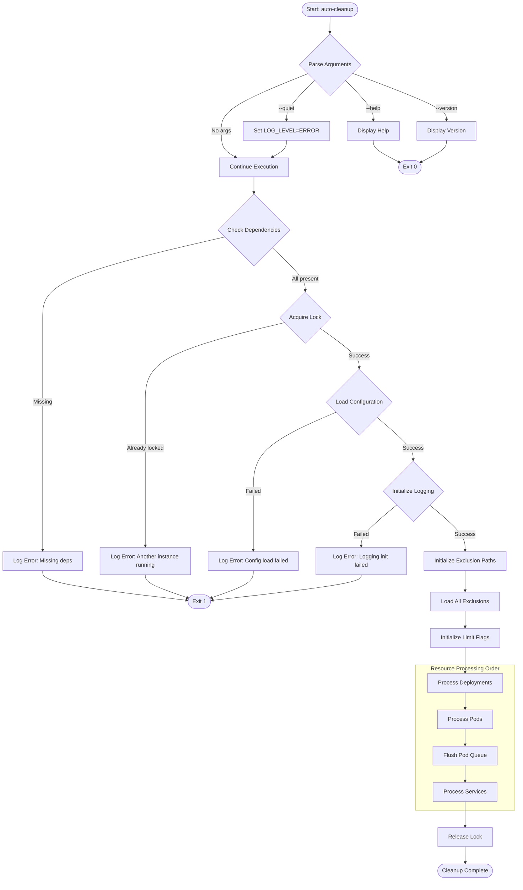
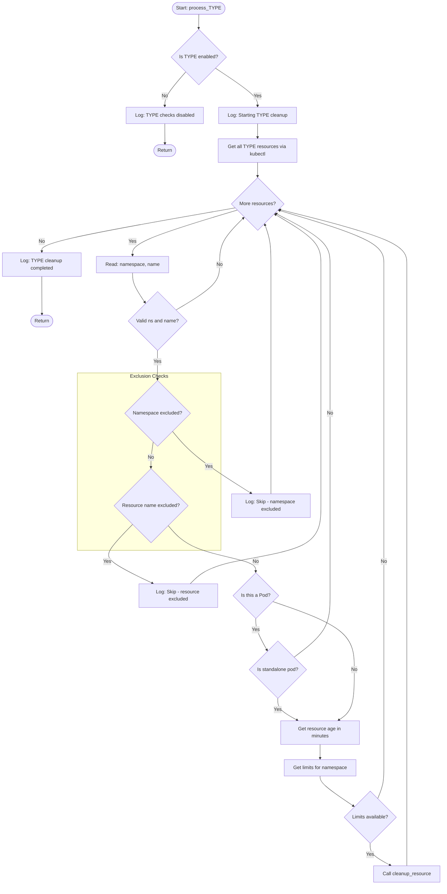
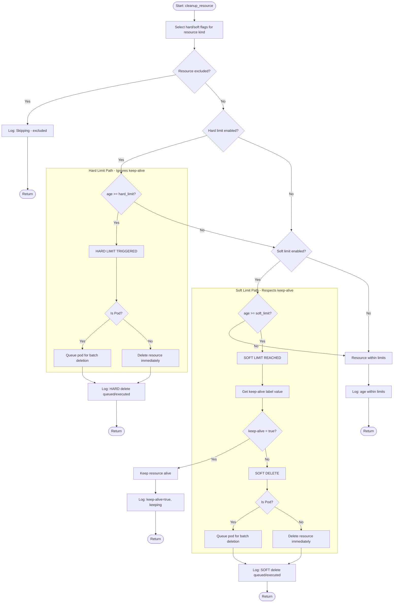
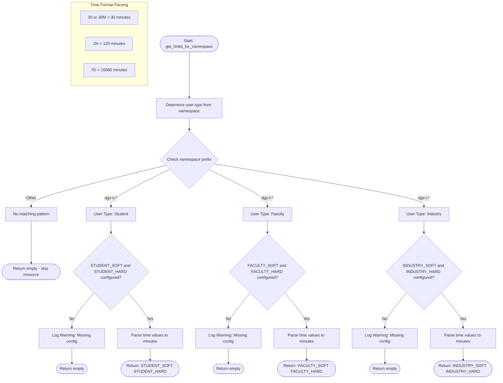
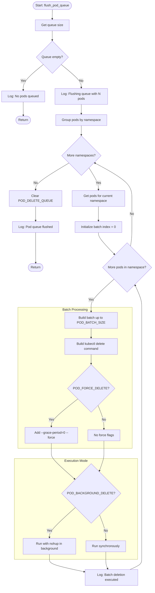
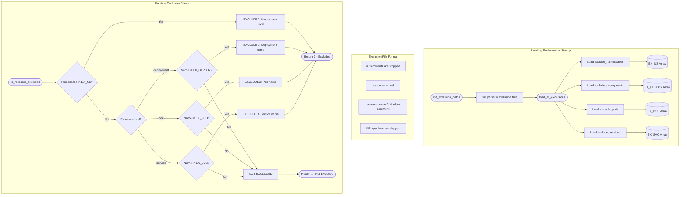
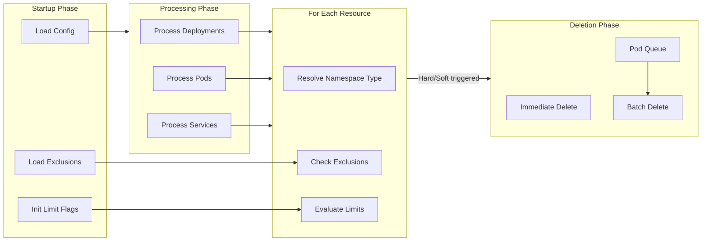

# Auto-Cleanup System Flowcharts

This document provides visual flowcharts to understand the logic and execution flow of the Auto-Cleanup system. Due to the complexity of the system, the documentation is organized into 6 sub-flowcharts, each focusing on a specific aspect.

## Table of Contents

1. [Main Execution Flow](#1-main-execution-flow)
2. [Resource Processing Flow](#2-resource-processing-flow)
3. [Limit Evaluation Decision](#3-limit-evaluation-decision-cleanup_resource)
4. [Namespace Type Resolution](#4-namespace-type-resolution)
5. [Pod Batch Deletion Flow](#5-pod-batch-deletion-flow)
6. [Exclusion Checking Flow](#6-exclusion-checking-flow)
7. [Flowchart Legend](#flowchart-legend)

---

## 1. Main Execution Flow

The high-level orchestration flow showing how `bin/auto-cleanup` coordinates the entire cleanup process.

**Key Points:**
- Dependencies checked: `kubectl`, `date`, `awk`, `grep`, `sed`, `flock`
- Lock file prevents concurrent execution: `/var/run/auto-cleanup.lock`
- Trap handler ensures lock release on exit/interrupt
- Resources processed in order: Deployments → Pods → Services

**Source:** [`bin/auto-cleanup`](../bin/auto-cleanup) (main function, lines 217-279)

---

## 2. Resource Processing Flow

Generic flow for processing each resource type (Deployments, Pods, or Services).

**Key Points:**
- Each resource type has its own `process_*` function but follows the same pattern
- Pods have an extra check: only **standalone pods** (no ownerReferences) are processed
- Managed pods (created by Deployments, Jobs, etc.) are skipped - their controllers handle them
- Namespace pattern filter: only `dgx-*` namespaces are processed

**Source:** [`lib/cleanup.sh`](../lib/cleanup.sh)
- `process_deployments()` (lines 347-378)
- `process_pods()` (lines 386-431)
- `process_services()` (lines 439-465)

---

## 3. Limit Evaluation Decision (cleanup_resource)

The core decision logic that determines whether a resource should be deleted.

**Key Points:**
- **Hard Limit**: Always deletes when age exceeds limit, **ignores** `keep-alive` label
- **Soft Limit**: Respects `keep-alive=true` label; only deletes if not set or `false`
- Pods are queued for batch deletion; Deployments and Services are deleted immediately
- Exclusions are checked first before any limit evaluation
- If the hard limit is not set and the user starts a pod/service/deployment with the `keep-alive` label, then the resource will not be auto-deleted.

**Source:** [`lib/cleanup.sh`](../lib/cleanup.sh) - `cleanup_resource()` (lines 139-226)

---

## 4. Namespace Type Resolution

How time limits are determined based on namespace naming convention.

**Default Configuration Values:**

| User Type | Namespace Prefix | Soft Limit | Hard Limit |
|-----------|------------------|------------|------------|
| Student   | `dgx-s-*`        | 24 hours   | 36 hours   |
| Faculty   | `dgx-f-*`        | 36 hours   | 84 hours   |
| Industry  | `dgx-i-*`        | 84 hours   | 168 hours  |

**Source:** [`lib/kubernetes.sh`](../lib/kubernetes.sh)
- `get_user_type()` (lines 42-56)
- `get_limits_for_namespace()` (lines 80-152)

---

## 5. Pod Batch Deletion Flow

The `flush_pod_queue()` logic for efficient batch deletion of queued pods.

**Configuration Options:**

| Setting | Default | Description |
|---------|---------|-------------|
| `POD_BATCH_SIZE` | 50 | Number of pods per kubectl delete command |
| `POD_FORCE_DELETE` | false | Use `--grace-period=0 --force` |
| `POD_BACKGROUND_DELETE` | true | Run kubectl in background (non-blocking) |

**Dual Optimization Strategy:**

The pod deletion combines TWO optimizations:

| Optimization | Mechanism | Effect |
|--------------|-----------|--------|
| **Intra-namespace batching** | Pods in the same namespace are combined into a single `kubectl delete pod p1 p2 ... -n ns` command | Reduces kubectl API calls |
| **Inter-namespace parallelism** | When `POD_BACKGROUND_DELETE=true`, each namespace's kubectl command runs in background (`nohup ... &`) | Namespaces are deleted simultaneously, not sequentially |

**Combined Effect Example:**

| Scenario | Pods | Namespaces | kubectl Commands | Execution |
|----------|------|------------|------------------|-----------|
| Best case | 100 | 1 | 2 (batches of 50) | Sequential |
| Typical | 100 | 5 (20 each) | 5 | Parallel |
| Worst case | 100 | 100 (1 each) | 100 | Parallel |

Even in the worst case (1 pod per namespace), background execution ensures all 100 deletions run **in parallel**, completing in roughly the time of a single deletion.

**Source:** [`lib/cleanup.sh`](../lib/cleanup.sh) - `flush_pod_queue()` (lines 238-335)

---

## 6. Exclusion Checking Flow

How exclusion lists are loaded and evaluated for resources.

**Exclusion File Locations:**

| File | Purpose |
|------|---------|
| `/etc/auto-cleanup/exclude_namespaces` | Namespace-level exclusions (skips ALL resources) |
| `/etc/auto-cleanup/exclude_deployments` | Specific deployment names to skip |
| `/etc/auto-cleanup/exclude_pods` | Specific pod names to skip |
| `/etc/auto-cleanup/exclude_services` | Specific service names to skip |

**Exclusion Hierarchy:**
1. **Namespace exclusion** is checked first (most powerful - skips all resources in that namespace)
2. **Resource-specific exclusion** is checked second (exact name match)

**Source:** [`lib/exclusions.sh`](../lib/exclusions.sh)
- `load_all_exclusions()` (lines 164-178)
- `is_resource_excluded()` (lines 282-321)

---

## Flowchart Legend

| Symbol | Meaning |
|--------|---------|
| `([Text])` | Terminal (Start/End) |
| `[Text]` | Process/Action |
| `{Text}` | Decision |
| `[(Text)]` | Database/Storage |
| `subgraph` | Logical grouping |
| Solid arrow | Normal flow |

## Cross-Reference Matrix

| Flowchart | Calls/Uses |
|-----------|-----------|
| 1. Main Execution | → 2. Resource Processing (for each type) |
| 2. Resource Processing | → 3. Limit Evaluation, → 4. Namespace Resolution, → 6. Exclusion Checking |
| 3. Limit Evaluation | → 6. Exclusion Checking (at start) |
| 5. Pod Batch Deletion | Called after 2. Resource Processing (pods) |

## Summary Diagram

A simplified overview of how all components interact:

---

## Related Documentation

- [Administrator Guide](Administrator-Guide.md) - Installation and configuration
- [README](../README.md) - Quick start and overview
- [Configuration File](../conf/auto-cleanup.conf) - All configurable options

