# Auto-Cleanup Dependency Graph

This document provides a visual representation of the dependency relationships between all components of the Auto-Cleanup system.

## Complete Dependency Graph

The comprehensive dependency structure showing modules, configuration files, and external dependencies.

```mermaid
%%{init: {'theme':'base', 'themeVariables': {'fontSize':'18px', 'primaryTextColor':'#000', 'primaryBorderColor':'#000', 'lineColor':'#000'}}}%%
graph TD
    subgraph MainScript ["<b>Main Entry Point</b>"]
        Main["<b>bin/auto-cleanup</b><br/><b>Main Script</b>"]
    end
    
    subgraph Libraries ["<b>Library Modules</b>"]
        Common["<b>lib/common.sh</b><br/><b>Base Module</b>"]
        Exclusions["<b>lib/exclusions.sh</b><br/><b>Exclusion Management</b>"]
        Kubernetes["<b>lib/kubernetes.sh</b><br/><b>Kubernetes API</b>"]
        Cleanup["<b>lib/cleanup.sh</b><br/><b>Cleanup Logic</b>"]
    end
    
    subgraph ConfigFiles ["<b>Configuration Files</b>"]
        Config["<b>auto-cleanup.conf</b>"]
        ExcludeNS["<b>exclude_namespaces</b>"]
        ExcludeDeploy["<b>exclude_deployments</b>"]
        ExcludePod["<b>exclude_pods</b>"]
        ExcludeSvc["<b>exclude_services</b>"]
    end
    
    subgraph External ["<b>External Dependencies</b>"]
        Kubectl["<b>kubectl</b>"]
        Date["<b>date</b>"]
        Awk["<b>awk</b>"]
        Grep["<b>grep</b>"]
        Sed["<b>sed</b>"]
        Flock["<b>flock</b>"]
        Timeout["<b>timeout</b>"]
    end
    
    %% Module dependencies
    Main -->|"<b>sources</b>"| Common
    Main -->|"<b>sources</b>"| Exclusions
    Main -->|"<b>sources</b>"| Kubernetes
    Main -->|"<b>sources</b>"| Cleanup
    
    Exclusions -->|"<b>uses</b>"| Common
    Kubernetes -->|"<b>uses</b>"| Common
    Cleanup -->|"<b>uses</b>"| Common
    Cleanup -->|"<b>uses</b>"| Exclusions
    Cleanup -->|"<b>uses</b>"| Kubernetes
    
    %% Configuration dependencies
    Main -->|"<b>loads</b>"| Config
    Exclusions -->|"<b>reads</b>"| ExcludeNS
    Exclusions -->|"<b>reads</b>"| ExcludeDeploy
    Exclusions -->|"<b>reads</b>"| ExcludePod
    Exclusions -->|"<b>reads</b>"| ExcludeSvc
    
    %% External command dependencies
    Main -->|"<b>requires</b>"| Kubectl
    Main -->|"<b>requires</b>"| Date
    Main -->|"<b>requires</b>"| Awk
    Main -->|"<b>requires</b>"| Grep
    Main -->|"<b>requires</b>"| Sed
    Main -->|"<b>requires</b>"| Flock
    Main -->|"<b>requires</b>"| Timeout
    
    Kubernetes -->|"<b>uses</b>"| Kubectl
    Common -->|"<b>uses</b>"| Date
    Common -->|"<b>uses</b>"| Flock
    Common -->|"<b>uses</b>"| Timeout
    Exclusions -->|"<b>uses</b>"| Sed
    Kubernetes -->|"<b>uses</b>"| Awk
    Common -->|"<b>uses</b>"| Grep
    Cleanup -->|"<b>uses</b>"| Timeout
    
    %% Styling
    classDef mainScript fill:#e1f5ff,stroke:#01579b,stroke-width:4px
    classDef library fill:#f3e5f5,stroke:#4a148c,stroke-width:3px
    classDef config fill:#fff3e0,stroke:#e65100,stroke-width:3px
    classDef external fill:#e8f5e9,stroke:#1b5e20,stroke-width:3px
    
    class Main mainScript
    class Common,Exclusions,Kubernetes,Cleanup library
    class Config,ExcludeNS,ExcludeDeploy,ExcludePod,ExcludeSvc config
    class Kubectl,Date,Awk,Grep,Sed,Flock,Timeout external
```

## Dependency Summary

### Module Dependencies

| Module | Depends On | Purpose |
|--------|-----------|---------|
| `bin/auto-cleanup` | All 4 library modules | Main orchestration script |
| `lib/cleanup.sh` | `common.sh`, `exclusions.sh`, `kubernetes.sh` | Core cleanup logic |
| `lib/kubernetes.sh` | `common.sh` | Kubernetes API wrappers |
| `lib/exclusions.sh` | `common.sh` | Exclusion list management |
| `lib/common.sh` | None | Base module (logging, config, utilities) |

### Configuration Dependencies

| Module | Configuration Variables |
|--------|------------------------|
| `lib/common.sh` | `LOG_DIR`, `LOG_LEVEL`, `MAX_LOG_SIZE`, `LOG_RETENTION_DAYS` |
| `lib/cleanup.sh` | `Deployment`, `Pod`, `Service`, `*_HardLimit`, `*_SoftLimit`, `POD_BATCH_SIZE`, `POD_FORCE_DELETE`, `POD_BACKGROUND_DELETE`, `MAX_CONCURRENT_DELETES`, `KUBECTL_TIMEOUT`, `WAIT_LOOP_TIMEOUT` |
| `lib/kubernetes.sh` | `STUDENT_SOFT`, `STUDENT_HARD`, `FACULTY_SOFT`, `FACULTY_HARD`, `INDUSTRY_SOFT`, `INDUSTRY_HARD` |

### External Command Dependencies

| Command | Used By | Purpose |
|---------|---------|---------|
| `kubectl` | `kubernetes.sh`, `cleanup.sh` | Kubernetes API operations |
| `date` | `common.sh`, `kubernetes.sh` | Timestamp operations |
| `awk` | `kubernetes.sh` | Parse kubectl output |
| `grep` | `common.sh` | Pattern matching |
| `sed` | `exclusions.sh` | Text processing |
| `flock` | `common.sh` | File locking |
| `timeout` | `cleanup.sh` | Process timeout |

### File Dependencies

| Module | Files Read |
|--------|-----------|
| `bin/auto-cleanup` | `conf/auto-cleanup.conf` |
| `lib/exclusions.sh` | `conf/exclude_namespaces`, `conf/exclude_deployments`, `conf/exclude_pods`, `conf/exclude_services` |

## Function Dependency Summary

| Function | Module | Calls Functions From |
|----------|--------|---------------------|
| `main()` | `bin/auto-cleanup` | `common.sh`, `exclusions.sh`, `cleanup.sh` |
| `process_deployments()` | `cleanup.sh` | `kubernetes.sh`, `exclusions.sh`, `common.sh` |
| `process_pods()` | `cleanup.sh` | `kubernetes.sh`, `exclusions.sh`, `common.sh` |
| `process_services()` | `cleanup.sh` | `kubernetes.sh`, `exclusions.sh`, `common.sh` |
| `cleanup_resource()` | `cleanup.sh` | `exclusions.sh`, `kubernetes.sh`, `common.sh` |
| `get_limits_for_namespace()` | `kubernetes.sh` | `common.sh` |
| `is_resource_excluded()` | `exclusions.sh` | `exclusions.sh` (internal), `common.sh` |
| `init_limit_flags()` | `cleanup.sh` | `common.sh` |

## Key Points

- **No circular dependencies**: The dependency graph is a directed acyclic graph (DAG)
- **Base module**: `lib/common.sh` has no module dependencies and provides foundation for all others
- **Dependency order**: Modules are loaded in order: `common.sh` → `exclusions.sh`/`kubernetes.sh` → `cleanup.sh`
- **Configuration**: Loaded at runtime via `load_config()` from `lib/common.sh`
- **Function calls**: Most cross-module calls are from `cleanup.sh` to other modules, with `common.sh` functions used throughout

## Related Documentation

- [Auto-Cleanup Flowcharts](Auto-Cleanup-Flowcharts.md) - Execution flow diagrams
- [Administrator Guide](Administrator-Guide.md) - Installation and configuration
- [User Guide](User-Guide.md) - Usage instructions
