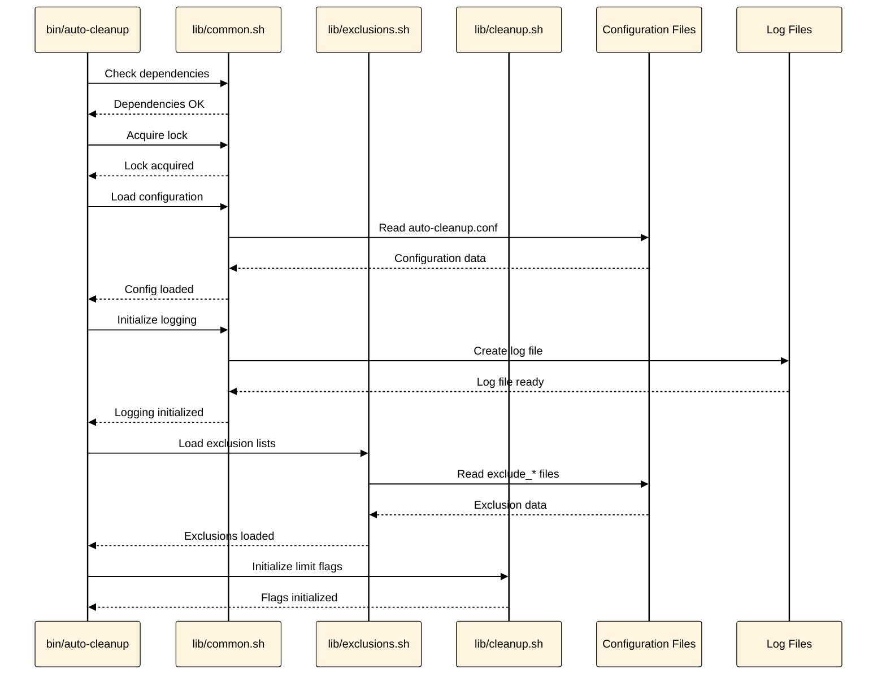
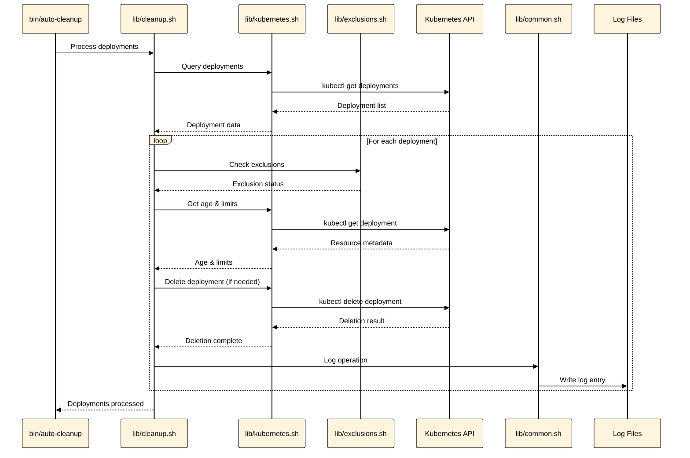
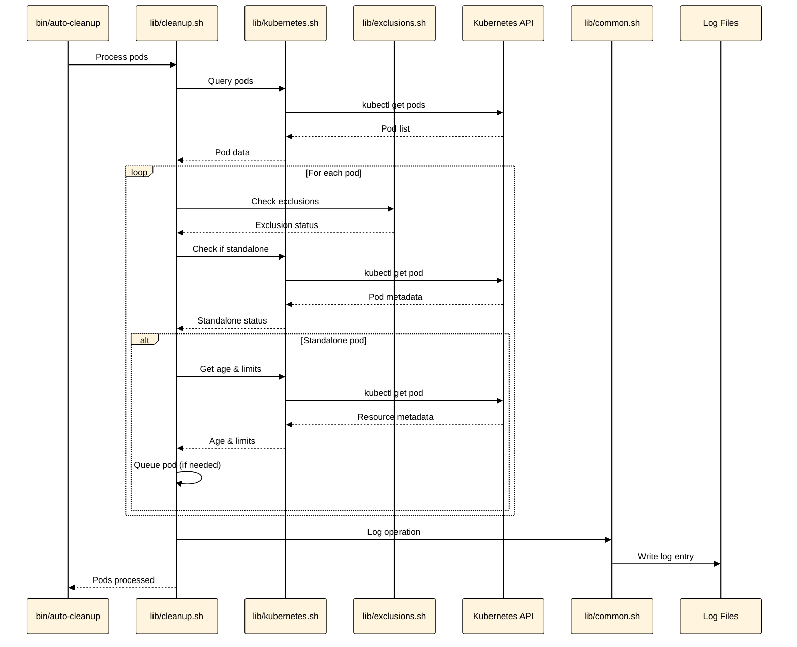
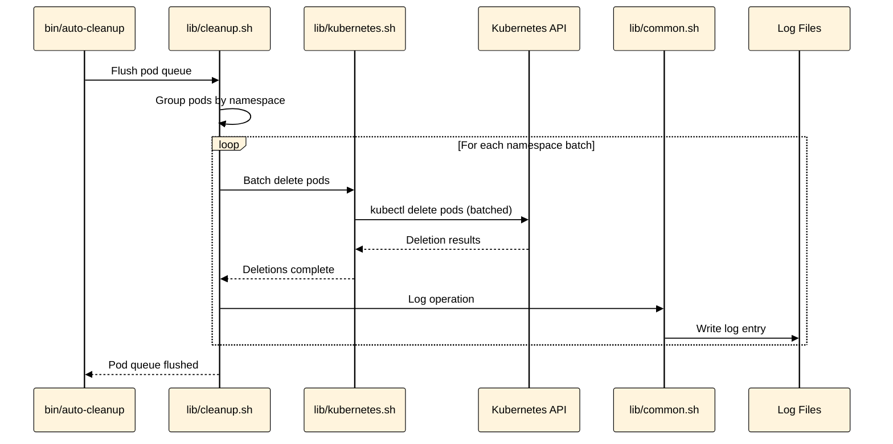
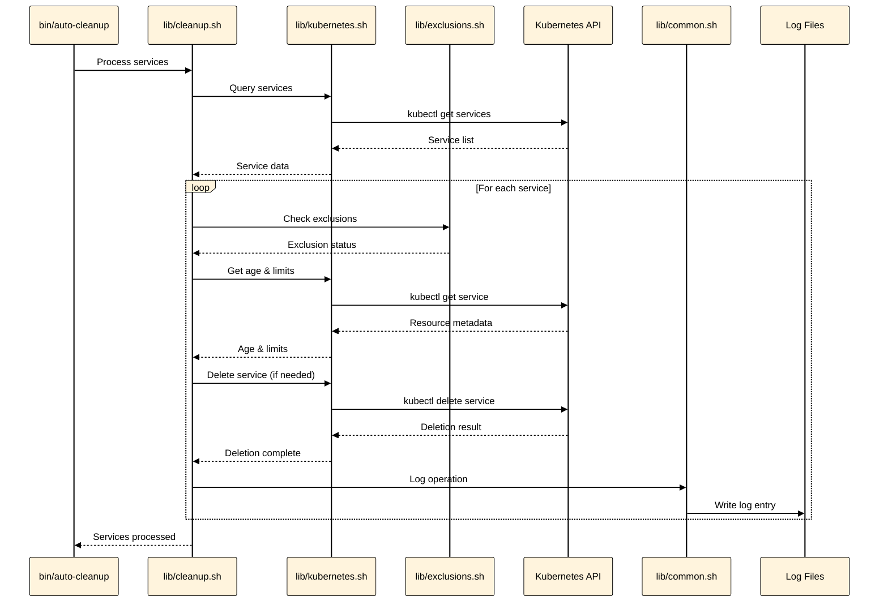
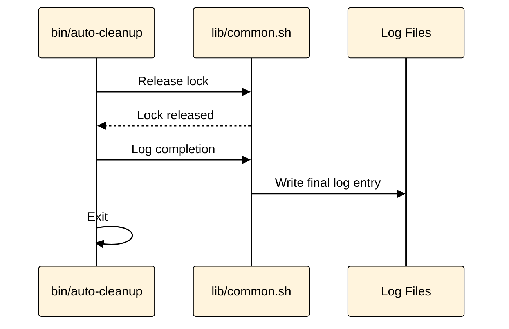

# Auto-Cleanup Sequence Diagram

Sequence diagrams showing the execution flow broken down into multiple stages for clarity.

---

## Stage 1: Initialization

Setup and configuration loading phase.

---

## Stage 2: Deployment Processing

Processing and cleanup of Kubernetes deployments.

---

## Stage 3: Pod Processing

Processing standalone pods and queueing them for batch deletion.

---

## Stage 4: Pod Queue Flush

Batch deletion of queued pods.

---

## Stage 5: Service Processing

Processing and cleanup of Kubernetes services.

---

## Stage 6: Cleanup

Final cleanup and lock release.

---

## Stage Summary

1. **Initialization**: Setup, configuration loading, and preparation
2. **Deployment Processing**: Query, evaluate, and delete deployments
3. **Pod Processing**: Query standalone pods and queue for deletion
4. **Pod Queue Flush**: Batch delete queued pods
5. **Service Processing**: Query, evaluate, and delete services
6. **Cleanup**: Release lock and finalize execution

## Key Interactions

- **Main ↔ Common**: Configuration, logging, and locking operations
- **Main ↔ Exclusions**: Loading exclusion lists
- **Main ↔ Cleanup**: Orchestrating resource processing
- **Cleanup ↔ Kubernetes**: Querying and deleting resources
- **Cleanup ↔ Exclusions**: Checking if resources are excluded
- **Kubernetes ↔ K8sAPI**: All Kubernetes API operations
- **Common ↔ Logs**: All logging operations

## Related Documentation

- [System Architecture](System-Architecture.md) - System component overview
- [Dependency Graph](Dependency-Graph.md) - Detailed module dependencies
- [Auto-Cleanup Flowcharts](Auto-Cleanup-Flowcharts.md) - Detailed execution flow diagrams
- [Administrator Guide](Administrator-Guide.md) - Installation and configuration
- [User Guide](User-Guide.md) - Usage instructions

