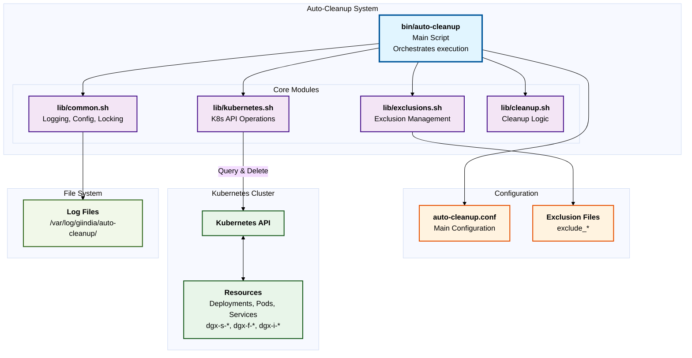

# Auto-Cleanup System Architecture

High-level system architecture diagram showing the main components and their interactions.

## System Architecture

## Component Overview

### Auto-Cleanup System
- **bin/auto-cleanup**: Main entry point that orchestrates the cleanup process
- **lib/common.sh**: Provides logging, configuration loading, and lock management
- **lib/exclusions.sh**: Manages exclusion lists for protected resources
- **lib/kubernetes.sh**: Handles all Kubernetes API interactions
- **lib/cleanup.sh**: Implements the core cleanup logic and policy evaluation

### External Systems
- **Configuration Files**: Control system behavior (time limits, policies, exclusions)
- **Kubernetes Cluster**: Target system containing resources to be cleaned
- **Log Files**: System logs stored on the file system

## Execution Flow

1. **Main script** loads configuration and all modules
2. **Cleanup module** queries Kubernetes API for resources
3. **Exclusions module** filters out protected resources
4. **Cleanup module** evaluates resources against policies
5. **Kubernetes module** deletes resources that meet criteria
6. **Common module** logs all operations

## Related Documentation

- [Dependency Graph](Dependency-Graph.md) - Detailed module dependencies
- [Auto-Cleanup Flowcharts](Auto-Cleanup-Flowcharts.md) - Execution flow diagrams
- [Administrator Guide](Administrator-Guide.md) - Installation and configuration
- [User Guide](User-Guide.md) - Usage instructions
